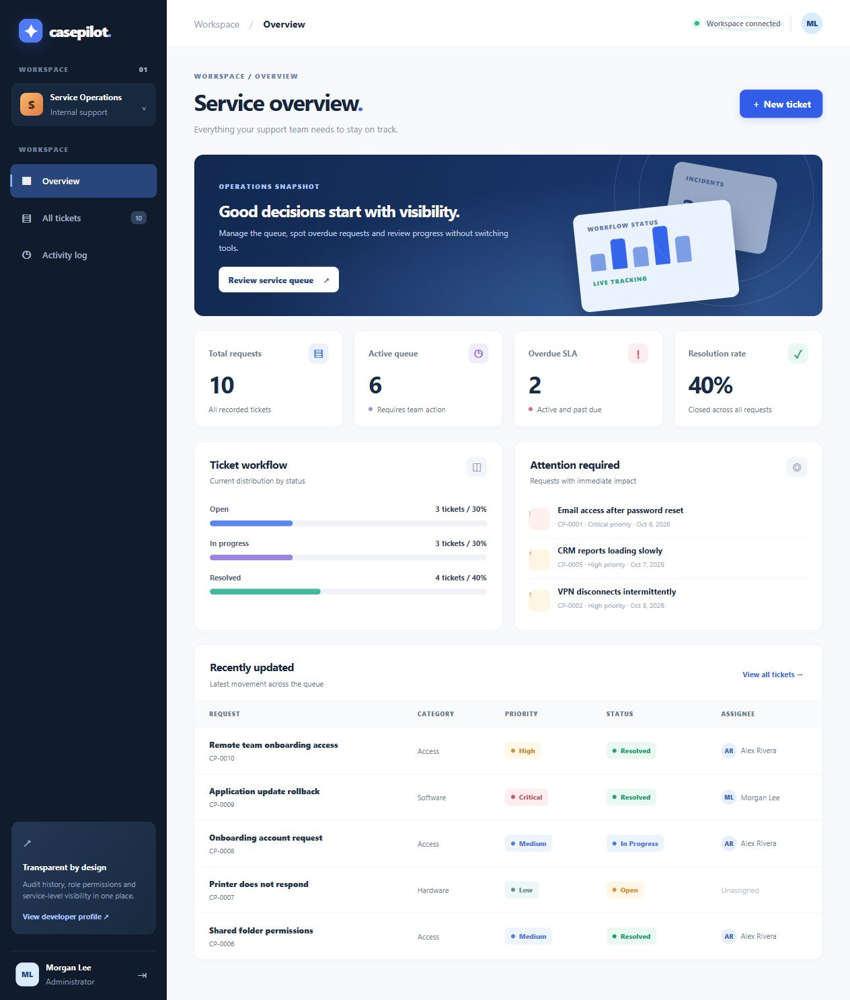

# CasePilot — IT Service Operations

A functional web application for managing support requests, service deadlines and team activity. **Built as a standalone portfolio project**, with no external Python dependencies, cloud accounts, API keys or paid services.

CasePilot is designed as an interview-friendly demonstration of **full-stack development, SQLite data modeling, authenticated REST-like endpoints, role-based authorization, input validation, data exports and automated integration tests**.



## What it does

- Dashboard with open, in-progress, resolved, overdue and critical indicators
- Ticket search and filtering by status, priority, requester and reference ID, with server-side pagination (25 per page, configurable up to 100)
- End-to-end workflow: open → in progress → resolved; reopening a closed ticket
- Two authenticated demo roles: administrator and support agent
- Administrative assignment, change tracking and internal notes
- Immutable activity events for every ticket action (app workflow does not offer edits or deletes)
- CSV exports filtered to the current ticket list
- SQLite persistence and deterministic seed dataset
- Responsive design, keyboard-accessible rows and reduced-motion support
- CSRF checking for state-changing actions, salted PBKDF2 password hashes, restrictive response headers, no third-party resources
- 22 HTTP integration tests, 4 frontend tests and a Windows/Linux CI matrix (Python 3.11 and 3.14)
- Windows background launcher, readiness checks, logs and a process-identity-checked stop command

## Quick start on Windows

Double-click `START_WINDOWS.bat` with Python 3.11+ installed.

Alternatively:

```powershell
cd C:\path\to\casepilot
.\START_WINDOWS.ps1
```

Then visit <http://127.0.0.1:8765>. The launcher runs Python in the background, waits for the health endpoint and opens the browser. To stop it, run `.\STOP_WINDOWS.ps1`; data is preserved. Use `-NoBrowser` for automated startup or `-Port 8766` for a separate port. Runtime logs and process metadata are kept in ignored `.runtime/`.

For a foreground terminal session, run `py -3 main.py` instead. The launcher stores demo data in `data/demo.sqlite3`; direct Python launch uses `casepilot.sqlite3` unless `CASEPILOT_DB` is set.

### Demo accounts

| Role | Username | Password |
| --- | --- | --- |
| Administrator | `admin` | `demo1234` |
| Support agent | `agent` | `agent1234` |

**Use demo credentials on localhost only.** Change credentials through environment variables before deployment; the first database initialization stores password hashes. This local portfolio demo is **not** a fully hardened production service.

Set `CASEPILOT_ADMIN_PASSWORD` and `CASEPILOT_AGENT_PASSWORD` before the very first launch to create different initial demo credentials. Set `CASEPILOT_DB` to configure the SQLite file location.

## Tests

No installation required beyond Python 3.11+:

```powershell
py -3 -W error::ResourceWarning -m unittest discover -s tests -v
node --test tests/frontend.test.cjs
```

Run `.\scripts\check.ps1` for Python compilation, JavaScript syntax, frontend tests (if Node is installed) and the HTTP suite. Node is optional for running the app.

The tests cover login/password validation, anonymous access, CSRF, ticket lifecycle, roles, notes, audit history, CSV filtering/formula protection, parameterized search, pagination, expiry, session rotation/capacity, login throttling, Host/Origin restrictions, database integrity and legacy password-hash migration. Frontend tests cover HTML escaping, overdue indicators, out-of-order search responses and network feedback. See [verification notes](docs/VERIFICATION.md) for actual local results and [security notes](SECURITY.md) for the boundary of this demo.

## Architecture

```text
Browser (HTML/CSS/JavaScript)
          |
          v
Python HTTP server (main.py)
  | authentication / sessions / CSRF
  | ticket validation / roles / workflow
  | search, stats, export and audit routes
          |
          v
SQLite (users, tickets, comments, audit_events)
```

The code intentionally has a small deployment footprint so reviewers can start it quickly. `main.py` uses only Python's standard library.

## API

| Method | Path | Purpose |
| --- | --- | --- |
| POST | `/api/login` | Create authenticated session |
| GET | `/api/session` | Return user + CSRF token |
| POST | `/api/logout` | End session |
| GET | `/api/health` | Database-aware readiness response |
| GET | `/api/config` | Whether local demo credentials are enabled |
| GET | `/api/stats` | Queue and SLA metrics |
| GET | `/api/users` | Assigned staff |
| GET | `/api/tickets` | Search/filter, `page`, `page_size` (1–100); returns `total`, `pages` |
| POST | `/api/tickets` | Create ticket |
| GET | `/api/tickets/:id` | Detail + comments + audit |
| PATCH | `/api/tickets/:id` | Change status / priority / assignee |
| POST | `/api/tickets/:id/comments` | Internal note |
| GET | `/api/activity` | Audit timeline |
| GET | `/api/export.csv` | Filterable CSV export |

## Deliberate limits and next milestones

This is a functional, local application, **not a production-certified help desk**. Current limitations include in-memory sessions, no TLS termination inside the Python server, no global concurrency/request limiting, no email notifications, no account management or password reset, one workspace shared by both roles, and unpaged CSV/audit detail exports. Login attempts are limited to eight per source IP per minute. The thread-per-request standard-library HTTP server is intended for local demonstrations; replacing it with a production server is required before a public deployment.

Non-local binding requires two custom password environment variables of at least 12 characters and refuses any existing database that still contains a demo password. Changing environment variables does not rotate stored credentials. Never expose the local demo database to the Internet. Set `CASEPILOT_ALLOWED_HOSTS` to trusted hostnames (comma separated), configure HTTPS termination and set `CASEPILOT_SECURE_COOKIE=1` when the browser uses HTTPS. Forwarded headers are not trusted.

Docker packaging runs as a non-root user. The Docker daemon was unavailable during local verification; its build/runtime remain unverified. A container should be bound to a loopback host port during demo use. Consult [security notes](SECURITY.md) before any deployment.

The project includes synthetic sample names and incidents only. It does not access the author's real university or customer systems.

## License

MIT (see `LICENSE`). Attribution and portfolio presentation should match the actual work and tools involved. Review, run and understand the source before describing implementation decisions in an interview.
